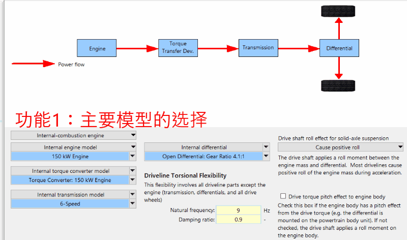
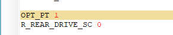
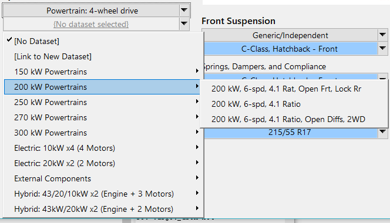
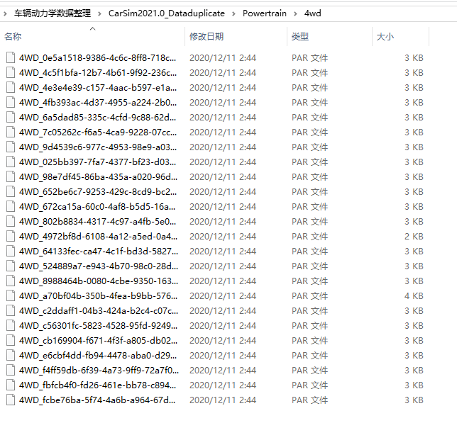
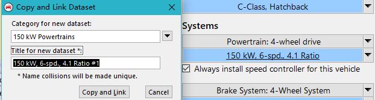
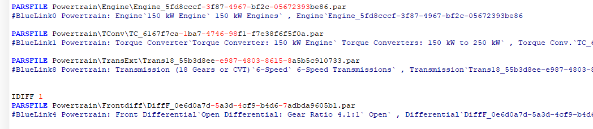
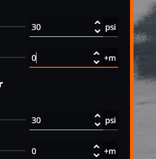
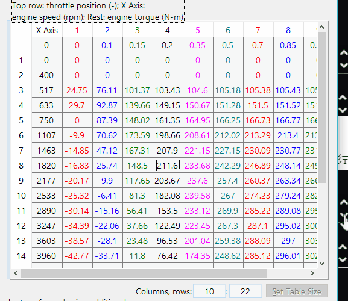
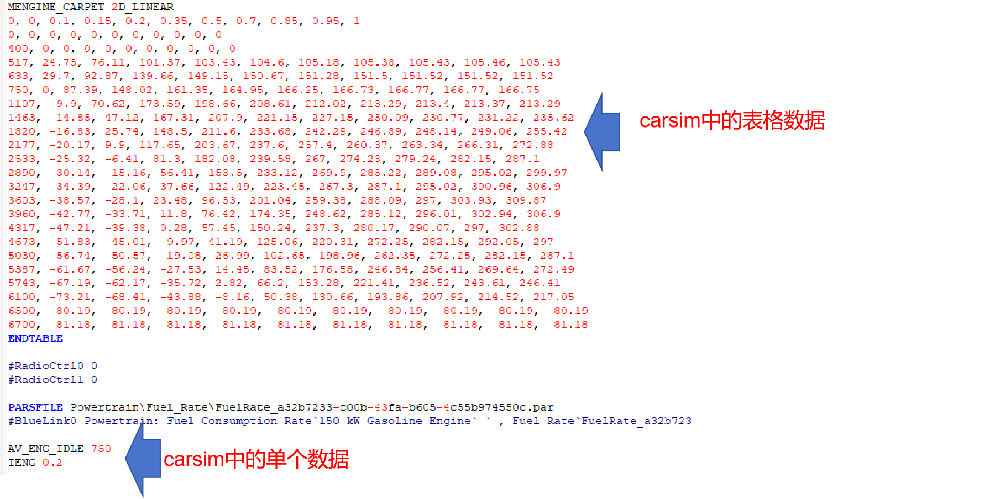

[返回](../前端功能说明.md)
## 参数编辑区模块功能说明
在Carsim中参数编辑区的功能其实由五个模块组成，其对应如下动图：

接下来我们逐步分析每个功能，并且从三个角度进行每个功能的说明
| 角度                  | 
|:----------------------|
| 前端代码               |
| 对应的具体数据  |
| 后端配置文件           |

| 主要功能                  | 
|:----------------------|
| 主要模型的选择               |
| 预定义配置文件的选择  |
| 子功能页面跳转           |
|修改预定义配置文件内参数|
|图表展示|
***
***

### 功能1：主要模型的选择
#### 前端代码：
实现该功能需要在前端界面实现下拉框，并且在下拉框填入对应的文本内容
下拉框示例如图：

#### 对应的具体数据
下拉框中的具体填入内容，已经在流程图中使用“【】”表示，
（这里可选的下拉选项是固定的，与功能2预定义配置文件选择不同）
[=======>流程图所在位置<========](https://kdocs.cn/l/ctURgwXLLiqf)

#### 后端配置文件
在carsim中，前端的每个页面与后端的每个par文件一一对应，前端每次点击后修改，都对应着后端某个数据的修改。
**个人猜测当用户离开当前页面的时候，会触发回调函数，将当前页面的所有数据保存至par文件。**
**因此需要做一个任务容器，回调函数会完成任务容器内的每个修改数据的任务。**

以车辆类型的选择为例子，选择完成后，carsim在后端会出先对应的选择序号

后端配置文件的样式还没有确定，但可以采用固定的参数名或者json的方式，可能更容易阅读

***
### 功能2：预定义配置文件的选择
#### 前端代码：
同样是下拉形式，但是选定的内容是数据库文件夹内对应的数据，以carsim为例子,其四驱下拉选项如图：

其对应的实际文件夹如下图，可以看到carsim为其进行了重新命名

由于是配置文件，所以该下拉选项的长度会根据文件夹内文件的数量决定，用户也可以自行更改或添加配置文件，如图,carsim允许用户复制已有的配置文件并且重新命名：

#### 对应的具体数据
每个下拉选项框会和一个固定的文件夹绑定，所以文件夹内所有par文件的命名，其实就是下拉选项框的数据来源。我们可以采用类似的策略，预定义数据。

#### 后端配置文件

carsim中对应着每个选项标注了一个具体的par文件，
可以使用json实现同样的功能。
***

### 功能3：页面跳转
#### 前端代码
需要实现一个页面跳转的代码
下一个页面的来源对应着功能1，主要模型的选择

#### 对应的具体数据
下一个页面内的参数对应着功能2，预定义配置文件的选择

#### 后端配置文件
进入下一个页面时，保存上一个页面的配置文件，并更改回调函数对应的文件

***

### 功能4：修改预定义配置文件内参数
#### 前端代码
这里分为两个类别，
**类别一：修改单个数据**
前端需要实现一个修改数据的功能

**类别二：修改表格数据**
前端需要预定义一个表格代码，允许调整表格大小，有些表格是二维的，有些表格是三维的，两种类型对应如图：

三维表格可以调整行和列数
二维表格只允许调整行数

#### 对应的具体数据
预定义的数据来自于功能2，当用户修改数据时，实际会修改后端配置文件相匹配的数据

#### 后端配置文件
同功能1，后端配置文件内的数据会对应一一修改

