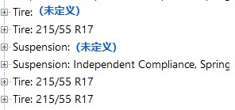

[返回](../前端功能说明.md)

## 流程图模块功能说明
[=======>流程图所在位置<========](https://kdocs.cn/l/ctURgwXLLiqf)
### 功能一：选择某一功能后，其会冒号对应该功能，如Powertrain:Engine;

- - -
### 功能二：如果用户没有定义某个参数或者某个功能，其在流程图中标蓝Powertrain:（未定义）；

- - -
### 功能三：点击流程图的某一模块，会跳转至配置界面；

- - -
### 功能四：参数编辑区输入参数时，流程图会自动刷新，且展开至对应的界面；

- - - 
### 功能五：数据配置冲突时，流程图中标红，并标上Powertrain:Engine（与运行控制：Simulink:Motor冲突）；
这个后续会在联合仿真时经常用到，当用户定义了某些参数由外部导入，但是在Rsim参数界面也同时设置了该参数时，两个参数便会产生冲突。
（可以在代码中通过维护一个参数名的有向图实现，哪两个数据同时定义时报错）

- - -
### 功能六: 增加一个按钮，跳转至下一个未定义，点击后，流程图和配置界面同时跳转至未定义处。
- - -
### 功能七：增加一个按钮，跳转至下一个配置冲突处，点击后，流程图和配置界面同时跳转至未定义处。
